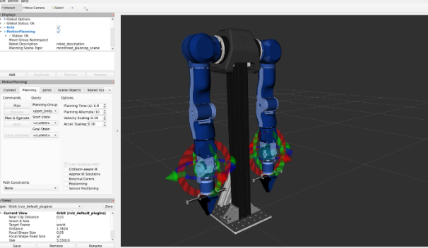

# OpenArm ROS2 Humble (Docker Compose)

This is a Docker container running ROS 2 Humble with the required OpenArm dependencies.

It uses:

- X11 forwarding for GUI applications (RViz, Gazebo, etc.)
- A shared `ws/` folder for code persistence
- Git submodules for further OpenArm Dependencies
- Host networking to interface with hardware (CAN, USB, etc.)

The container automatically builds the workspace on startup via `entrypoint.sh`.


---


# 📥 Git Clone with submodules 

```bash
git clone --recurse-submodules https://github.com/memoryisthekey/OpenArmDocker_Windows.git
```

If you forgot `--recurse-submodules`:

```bash
cd openarm
git submodule update --init --recursive
```

---
# 🖥 X11 (GUI Support)

Before starting the container, allow Docker to access your display:
Start your X11 Server
(https://sourceforge.net/projects/vcxsrv/)

<!-- ```bash
xhost +local:docker
```

**If you do not run this, GUI applications will not open.**

After you are done:

```bash
xhost -local:docker
```
-->
---

# 🐳 Docker

### Build & Start

```bash
docker compose up --build
```

### Exec into container
> This command is like SSH into the container
```bash
docker exec -it openarm bash
```

---
# 🚀 Running the Open Arm


## Set the CAN Interfaces 
Run the following commands to activate the CAN interface in the container and control the hardware
> For CAN FD at 5mbps (recommended)

* can0 (left arm)
```bash
openarm-can-configure-socketcan can0 -fd -b 1000000 -d 5000000
```

* can1 (right arm)
```bash
openarm-can-configure-socketcan can1 -fd -b 1000000 -d 5000000
```

Below are example commands from the official OpenArm ROS2 control documentation:  
https://docs.openarm.dev/software/ros2/control

## Launch with fake hardware (for testing)
```bash
ros2 launch openarm_bringup openarm.launch.py arm_type:=v10 use_fake_hardware:=true
```

## Launch files

* openarm.launch.py - Single arm configuration
* openarm.bimanual.launch.py - Dual arm configuration

### Key Parameters

* arm_type - Arm type (default: v10)
* use_fake_hardware - Use fake hardware instead of real hardware (default: false)
* can_interface - CAN interface to use (default: can0)
* robot_controller - Controller type: joint_trajectory_controller or forward_position_controller

When you run the bringup launch files, robot state publisher, controller manager, etc. will be launched.

After the controllers are successfully launched, you can verify they're working by checking the available actions:

### ros2 action list

To test joint movement, send a simple trajectory command:
```bash
ros2 action send_goal /joint_trajectory_controller/follow_joint_trajectory control_msgs/action/FollowJointTrajectory '{trajectory: {joint_names: ["openarm_joint1", "openarm_joint2", "openarm_joint3", "openarm_joint4", "openarm_joint5", "openarm_joint6", "openarm_joint7"], points: [{positions: [0.15, 0.15, 0.15, 0.15, 0.15, 0.15, 0.15], time_from_start: {sec: 3, nanosec: 0}}]}}'
```

This command moves all arm joints to a 0.15 radian position over 3 seconds.

## Controlling real robot through ROS Actions on Bimanual launch:

```bash
ros2 launch openarm_bringup openarm.bimanual.launch.py arm_type:=v10 use_fake_hardware:=false
```

This will move the last joint of the right arm to 90 degrees over 2 seconds:
```bash
 ros2 action send_goal /right_joint_trajectory_controller/follow_joint_trajectory control_msgs/action/FollowJointTrajectory '{trajectory: {joint_names: ["openarm_right_joint1", "openarm_right_joint2", "openarm_right_joint3", "openarm_right_joint4", "openarm_right_joint5", "openarm_right_joint6", "openarm_right_joint7"], points: [{positions: [0.0, 0.0, 0.0, 0.0, 0.0, 0.0, 1.57], time_from_start: {sec: 2, nanosec: 0}}]}}'
```

## Getting Started with MoveIt2
To use the MoveIt2 integration:

Launch the MoveIt2 demo:

```bash 
ros2 launch openarm_bimanual_moveit_config demo.launch.py
```
---

# 📂 Workspace (ws/)

The `ws/` folder on your host is mounted into the container as:

```
/home/ros/ros2_ws/src
```

This means:

- Any code changes you make locally in `ws/`
- Are immediately available inside the container

When the container starts,a bash file is run -> `entrypoint.sh`, it will:

- Sources ROS 2 Humble
- Runs `colcon build` automatically
- Drops you into a ready ROS environment

You do not need to manually build after starting the container.

---

## 🧹  Docker Management (Cleanup)

<details>
<summary>Docker cleanup commands</summary>

Remove stopped containers:

```bash
docker rm $(docker ps -aq)
```

Remove unused images:

```bash
docker image prune -a
```

Full cleanup:

```bash
docker system prune
```

</details>
